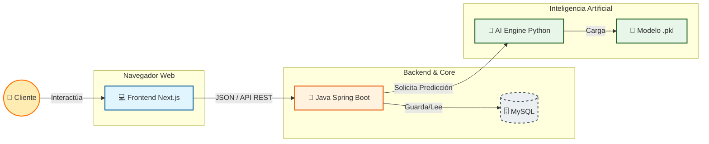

# 🛡️ RetainAI | Predicción de Fuga de Clientes

Solución **Enterprise de Inteligencia Artificial** para predecir la cancelación de clientes en el sector de telecomunicaciones.

Proyecto desarrollado para el **Challenge ONE - No Country 2025**.

---

## 🏗️ Arquitectura del Sistema

El sistema utiliza una **arquitectura de Microservicios Híbrida**, diseñada para desplegarse en **Oracle Cloud Infrastructure (OCI)**.



---

## 🛠️ Stack Tecnológico

| Componente    | Tecnología                     | Rol                                                     |
| ------------- | ------------------------------ | ------------------------------------------------------- |
| **AI Engine** | Python (FastAPI, Scikit-learn) | Limpieza de datos, entrenamiento ML y API de inferencia |
| **Backend**   | Java Spring Boot               | Lógica de negocio, gestión de usuarios y orquestación   |
| **Frontend**  | Next.js                        | Dashboard interactivo de visualización de riesgo        |
| **DevOps**    | Docker, OCI                    | Despliegue, contenerización e infraestructura           |

---

## 📂 Estructura del Monorepo

Cada equipo tiene su propio directorio de trabajo. **Respetar esta estructura es obligatorio**.

```bash
RetainAI/
├── ai-ml/                  # 🐍 SQUAD DATA SCIENCE (Python)
│   ├── data/               # Datos crudos (TelecomX.json)
│   ├── models/             # Artefactos generados (.pkl)
│   ├── notebooks/          # Notebooks para análisis (EDA)
│   ├── src/                # Código fuente de la API (FastAPI)
│   └── requirements.txt    # Dependencias de Python
│
├── backend/                # ☕ SQUAD BACKEND (Java Spring Boot)
│   ├── src/main/java/      # Código fuente Java
│   ├── src/main/resources/ # Configuración (application.properties)
│   └── pom.xml             # Dependencias Maven
│
├── frontend/               # 🎨 SQUAD FRONTEND (Next.js)
│   ├── src/app/            # Páginas y rutas
│   ├── src/components/     # Componentes reutilizables
│   └── package.json        # Dependencias Node.js
│
├── docs/                   # 📚 DOCUMENTACIÓN Y REGLAS
│   ├── REGLAS_DEL_JUEGO.md  # ⚠️ LEER ANTES DE EMPEZAR
│   └── API_CONTRACT.md     # Definición de contratos JSON
│
└── docker-compose.yml      # Orquestador para levantar todo localmente
```

---

## 🚀 Guía de Instalación Rápida

🚨 **Antes de empezar**: Lee las **Reglas del Juego** para conocer el flujo de Git y evitar conflictos.

### 1️⃣ Clonar el repositorio

```bash
git clone https://github.com/gian-pc/RetainAI.git
cd RetainAI
```

---

### 2️⃣ Levantar todo el entorno (Docker) — *Opción Recomendada*

Si tienes Docker instalado, este comando levanta **Backend, Frontend, AI y Base de Datos** automáticamente.

```bash
docker-compose up
```

---

### 3️⃣ Instalación Manual por Equipos

<details>
<summary>🐍 Equipo Data Science</summary>

```bash
cd ai-ml
python -m venv .venv
source .venv/bin/activate  # Windows: .venv\Scripts\activate
pip install -r requirements.txt
uvicorn src.main:app --reload --port 8000
```

</details>

<details>
<summary>☕ Equipo Backend</summary>

```bash
cd backend
./mvnw spring-boot:run
```

</details>

<details>
<summary>🎨 Equipo Frontend</summary>

```bash
cd frontend
npm install
npm run dev
```

</details>

---

## 📊 Estado del Proyecto

* [x] **Fase 1**: Data Science (Limpieza, EDA y Entrenamiento de modelo Random Forest)
* [ ] **Fase 2**: Backend (Configuración Spring Boot y MySQL)
* [ ] **Fase 3**: Frontend (Dashboard Next.js)
* [ ] **Fase 4**: Integración (Conexión de APIs)
* [ ] **Fase 5**: Despliegue (Docker + Oracle Cloud)

---

## 👨‍💻 Autor

**gianpc**
Fullstack AI Developer
