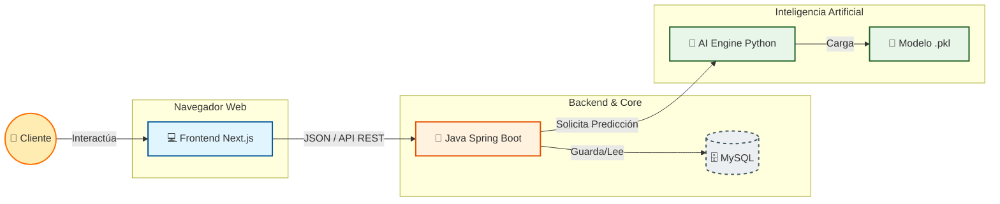

# 🛡️ RetainAI | Predicción de Fuga de Clientes

Solución **Enterprise de Inteligencia Artificial** para predecir la cancelación de clientes en el sector de telecomunicaciones.

Proyecto desarrollado para el **Challenge ONE - No Country 2025**.

---

## 🏗️ Arquitectura del Sistema

El sistema utiliza una **arquitectura de Microservicios Híbrida**, diseñada para desplegarse en **Oracle Cloud Infrastructure (OCI)**.



---

## 🛠️ Stack Tecnológico

| Componente    | Tecnología                     | Rol                                                     |
| ------------- | ------------------------------ | ------------------------------------------------------- |
| **AI Engine** | Python (FastAPI, Scikit-learn) | Limpieza de datos, entrenamiento ML y API de inferencia |
| **Backend**   | Java Spring Boot               | Lógica de negocio, gestión de usuarios y orquestación   |
| **Frontend**  | Next.js                        | Dashboard interactivo de visualización de riesgo        |
| **DevOps**    | Docker, OCI                    | Despliegue, contenerización e infraestructura           |

---

## 📂 Estructura del Monorepo

Cada equipo tiene su propio directorio de trabajo. **Respetar esta estructura es obligatorio**.

```bash
RetainAI/
├── ai-ml/                  # 🐍 SQUAD DATA SCIENCE (Python)
│   ├── data/               # Datos crudos (TelecomX.json)
│   ├── models/             # Artefactos generados (.pkl)
│   ├── notebooks/          # Notebooks para análisis (EDA)
│   ├── src/                # Código fuente de la API (FastAPI)
│   └── requirements.txt    # Dependencias de Python
│
├── backend/                # ☕ SQUAD BACKEND (Java Spring Boot)
│   ├── src/main/java/      # Código fuente Java
│   ├── src/main/resources/ # Configuración (application.properties)
│   └── pom.xml             # Dependencias Maven
│
├── frontend/               # 🎨 SQUAD FRONTEND (Next.js)
│   ├── src/app/            # Páginas y rutas
│   ├── src/components/     # Componentes reutilizables
│   └── package.json        # Dependencias Node.js
│
├── docs/                   # 📚 DOCUMENTACIÓN Y REGLAS
│   ├── REGLAS_DEL_JUEGO.md  # ⚠️ LEER ANTES DE EMPEZAR
│   └── API_CONTRACT.md     # Definición de contratos JSON
│
└── docker-compose.yml      # Orquestador para levantar todo localmente
```

---

## 🚀 Guía de Instalación Rápida

🚨 **Antes de empezar**: Lee las **Reglas del Juego** para conocer el flujo de Git y evitar conflictos.

### 1️⃣ Clonar el repositorio

```bash
git clone https://github.com/gian-pc/RetainAI.git
cd RetainAI
```

---

### 2️⃣ Levantar todo el entorno (Docker) — *Opción Recomendada*

Si tienes Docker instalado, este comando levanta **Backend, Frontend, AI y Base de Datos** automáticamente.

```bash
docker-compose up
```

---

### 3️⃣ Instalación Manual por Equipos

<details>
<summary>🐍 Equipo Data Science</summary>

```bash
cd ai-ml
python -m venv .venv
source .venv/bin/activate  # Windows: .venv\Scripts\activate
pip install -r requirements.txt
uvicorn src.main:app --reload --port 8000
```

</details>

<details>
<summary>☕ Equipo Backend</summary>

```bash
cd backend
./mvnw spring-boot:run
```

</details>

<details>
<summary>🎨 Equipo Frontend</summary>

```bash
cd frontend
npm install
npm run dev
```

</details>

---

## 📊 Estado del Proyecto

* [x] **Fase 1**: Data Science (Limpieza, EDA y Entrenamiento de modelo Random Forest)
* [x] **Fase 2**: Backend (Configuración Spring Boot y MySQL)
* [x] **Fase 3**: Frontend (Dashboard Next.js)
* [x] **Fase 4**: Integración (Conexión de APIs)
* [x] **Fase 5**: Features EXTRA Implementadas
  * [x] IA Explicable (XAI) con main_factor y next_best_action
  * [x] Mapa geográfico con Mapbox GL JS
  * [x] Asistente IA conversacional (Speech-to-Text + Text-to-Speech)
  * [x] Integración con Google Gemini API
  * [x] Priorización de acciones por impacto económico
* [ ] **Fase 6**: Despliegue (Docker + Oracle Cloud)

### 🌟 Features Implementadas

#### Centro de Comando (Home)
- ✅ 4 KPIs principales: Revenue at Risk, Churn Rate, Customers at Risk, Avg NPS
- ✅ Mapa geográfico interactivo con heatmap de riesgo
- ✅ Filtros por país/ciudad (New York, London, Berlin, Toronto)
- ✅ AI Insight Box con datos en tiempo real

#### Acciones Prioritarias
- ✅ Tarjetas de clientes ordenadas por impacto económico
- ✅ Algoritmo de scoring: riskProbability × annualRevenue
- ✅ Botones de acción rápida: View Profile, Call, Email
- ✅ Factor principal de riesgo para cada cliente

#### Perfil de Cliente
- ✅ Datos completos del cliente (ciudad, segmento, suscripción, métricas)
- ✅ Predicción de churn en tiempo real
- ✅ Explicabilidad IA: Risk level, Probability, Main factor, Next best action
- ✅ Botón refresh para actualizar predicción

#### Asistente IA Multimodal
- ✅ Botón flotante con modal de chat
- ✅ Integración con Google Gemini API
- ✅ Reconocimiento de voz (Speech-to-Text)
- ✅ Síntesis de voz (Text-to-Speech)
- ✅ Contexto en tiempo real con datos del dashboard
- ✅ Respuestas inteligentes basadas en keywords

---

## 🤖 Configurar Google Gemini API (Opcional)

El asistente IA funciona de dos formas:

### Sin API Key (Por defecto)
- ✅ Respuestas simuladas inteligentes
- ✅ Usa datos reales del dashboard
- ✅ No requiere configuración

### Con API Key de Gemini (Recomendado)
- ✅ Respuestas generadas por IA
- ✅ Conversaciones más naturales
- ✅ Mejor comprensión de contexto

**Pasos rápidos:**

1. Obtén tu API key: https://aistudio.google.com/app/apikey

2. Crea archivo `.env` en `backend/`:
```bash
cd backend
cp .env.example .env
```

3. Agrega tu API key:
```properties
GEMINI_API_KEY=tu_api_key_aqui
```

4. Reinicia el backend:
```bash
mvn spring-boot:run
```

📚 **Guía completa**: Ver `docs/GEMINI_SETUP.md`

---

## 👨‍💻 Integrantes

| Nombre | Especialidad | LinkedIn | Github |
|--------|-------------|----------|
| Gian Carlos Paucar Cortez | Backend Developer | [Perfil](https://www.linkedin.com/in/gian-pc/) | [Repositorio](https://github.com/gian-pc) | 
| Juan Francisco Jesús Hernández López | Backend Developer | [Perfil](https://www.linkedin.com/in/juan-francisco-jes%C3%BAs-hern%C3%A1ndez-l%C3%B3pez-7bba50129/) |  [Repositorio](https://github.com/JohnnyBCool) | 
| Leandro Darío Pollano | Backend Developer | [Perfil](https://www.linkedin.com/in/leandro-dario-pollano/) | [Repositorio](https://github.com/LDP33) |
| Bianca Perrotta | Backend Developer | [Perfil](https://www.linkedin.com/in/bianca-perrotta/) | [Repositorio](https://github.com/biancaperrotta2) |  
| Luis Carvajal | Backend Developer | [Perfil](https://www.linkedin.com/in/luis-carlos-carvajal-888bb0125/) | [Repositorio](https://github.com/Luis2025-spec) |
| Gabriel Gutiérrez Tejeda | Data Scientist | [Perfil](https://www.linkedin.com/in/gabriel-guti%C3%A9rrez-tejeda-23413133/) | [Repositorio](https://github.com/GabrielGitHub1709) |
| Iván René Cuéllar Rodríguez | Data Scientist | [Perfil](https://www.linkedin.com/in/iv%C3%A1n-ren%C3%A9-cu%C3%A9llar-rodr%C3%ADguez-ab70a7204/) |[Repositorio](https://github.com/Ivanovk82) |
| Vanessa Oreza | Data Scientist | [Perfil](https://www.linkedin.com/in/vanessa-oreza-04741919b/) | [Repositorio](https://github.com/vanessa-oreza) |
| Marcelo Collipal Rojas | Data Scientist | [Perfil](https://www.linkedin.com/in/marcelo-collipal-rojas-79a3693b/) |  [Repositorio](https://github.com/macollipal) |

H12-25-L-Equipo 29 – Data Science
RetainAI

