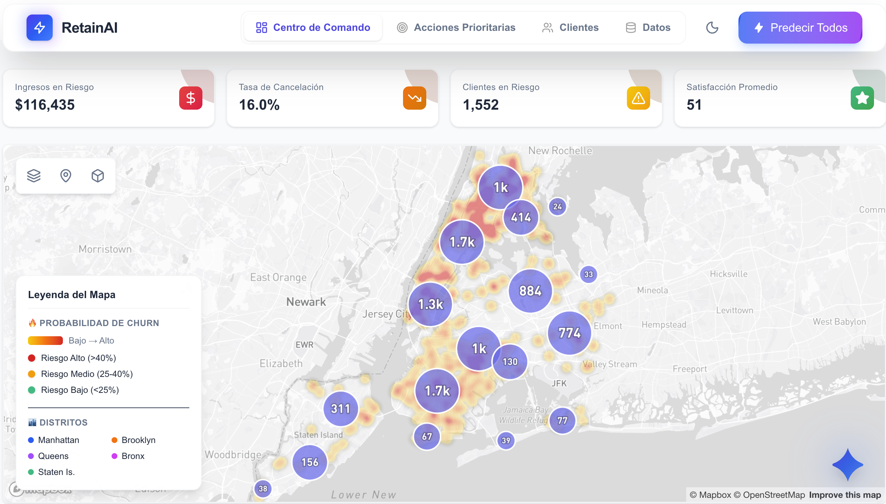
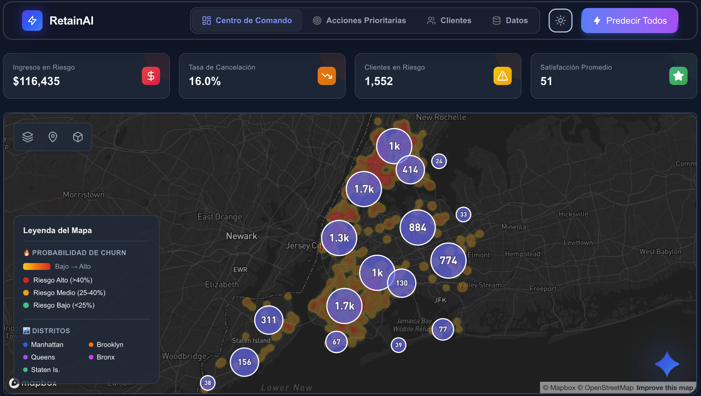

# 🛡️ RetainAI | Sistema Inteligente de Prevención de Churn


**RetainAI** es un ecosistema completo de Inteligencia Artificial que no solo predice el churn de clientes, sino que **explica el porqué** y **recomienda acciones proactivas** de retención. Construido con arquitectura de microservicios para el **Hackathon ChurnInsight - Challenge ONE (Oracle + Alura 2025)**.

---

## 🎯 ¿Qué es RetainAI?

RetainAI transforma la predicción pasiva de churn en un **Sistema de Acción Proactiva** con:

- 🧠 **IA Explicable (XAI)**: No solo predice, explica el factor principal de riesgo
- 🗺️ **Visualización Geográfica**: Mapas de calor en tiempo real con Mapbox GL JS
- 🤖 **Asistente Multimodal**: Chatbot con voz (Google Gemini + Speech-to-Text/Text-to-Speech)
- ⚡ **Acciones Automáticas**: Envío de emails personalizados vía OCI Email Delivery
- 📊 **Dashboard Empresarial**: KPIs, métricas y análisis de cohortes
- ☁️ **Production-Ready**: Optimizado para Oracle Cloud Infrastructure (OCI)

---

## 📸 Vista Previa de la Aplicación

### Dashboard Principal - Modo Claro


### Dashboard Principal - Modo Oscuro


**Características visuales:**
- 🎨 Modo claro y oscuro
- 📊 4 KPIs principales (Revenue at Risk, Churn Rate, Customers at Risk, NPS)
- 🗺️ Mapa interactivo con heatmap de riesgo geográfico
- 🎯 Leyenda de probabilidad de churn (Bajo → Alto)
- 📍 Distribución por distritos de New York

---

## 🏗️ Arquitectura del Sistema

```
┌─────────────────────────────────────────────────────────────────────┐
│                         ORACLE CLOUD (OCI)                          │
│  ┌────────────────┐  ┌──────────────────┐  ┌───────────────────┐  │
│  │ Container      │  │ MySQL HeatWave   │  │ Object Storage    │  │
│  │ Instances      │  │ (Database)       │  │ (Assets)          │  │
│  └────────────────┘  └──────────────────┘  └───────────────────┘  │
└─────────────────────────────────────────────────────────────────────┘
                                  │
        ┌─────────────────────────┼─────────────────────────┐
        │                         │                         │
┌───────▼────────┐       ┌────────▼────────┐      ┌────────▼────────┐
│   Frontend     │       │    Backend      │      │   ML Service    │
│   (Next.js)    │◄─────►│  (Spring Boot)  │◄────►│   (FastAPI)     │
│   Port: 3000   │       │   Port: 8080    │      │   Port: 8000    │
└────────────────┘       └─────────────────┘      └─────────────────┘
     │                           │                          │
     ├──────────────┐            ├─────────────┐           │
     │ Mapbox GL    │            │ OCI Email   │           │
     │ (Heatmaps)   │            │ Delivery    │           │
     └──────────────┘            └─────────────┘           │
     │                           │                          │
     ├──────────────┐            ├─────────────┐           ├───────────┐
     │ Google       │            │ Google      │           │ scikit-   │
     │ Gemini API   │            │ Gemini API  │           │ learn     │
     │ (Chatbot)    │            │ (Analysis)  │           │ Pipeline  │
     └──────────────┘            └─────────────┘           └───────────┘
     │
     ├──────────────┐
     │ ElevenLabs   │
     │ (TTS/Voice)  │
     └──────────────┘

Flujo de Predicción:
1. Usuario interactúa con Dashboard (Frontend - Next.js)
2. Frontend envía datos del cliente → Backend (Spring Boot)
3. Backend prepara input → ML Service (FastAPI)
4. ML Service ejecuta pipeline RandomForest → Retorna predicción + explicación
5. Backend almacena en MySQL → Retorna a Frontend
6. Frontend muestra en Dashboard + Mapa de calor geográfico
7. Asistente IA responde preguntas con contexto en tiempo real
```

---

## 🛠️ Stack Tecnológico

### Frontend (Puerto 3000)
- **Framework**: Next.js 16 + React 19 + TypeScript
- **Estilos**: TailwindCSS v4
- **Mapas**: Mapbox GL JS
- **Visualización**: Recharts
- **IA Conversacional**: Google Gemini API
- **Voz**: Web Speech API + ElevenLabs TTS

### Backend (Puerto 8080)
- **Framework**: Java 21 + Spring Boot 3.3.0
- **Base de Datos**: MySQL HeatWave (OCI)
- **IA Generativa**: Google Gemini API
- **Email**: OCI Email Delivery
- **Seguridad**: Spring Security

### ML Service (Puerto 8000)
- **Framework**: Python 3.9+ + FastAPI
- **ML Library**: scikit-learn
- **Modelo**: RandomForest (95.54% accuracy, AUC-ROC 0.9843)
- **Pipeline**: Imputer → Encoder → Scaler → RandomForest
- **Explicabilidad**: XAI con factores principales

### DevOps
- **Contenerización**: Docker + Docker Compose
- **Cloud**: Oracle Cloud Infrastructure (OCI)
  - Container Instances
  - MySQL HeatWave
  - Object Storage
  - Email Delivery

---

## 🔑 APIs Necesarias

Para ejecutar todas las funcionalidades de RetainAI necesitas configurar estas APIs:

### 1. Google Gemini API (Requerido para Chatbot IA)
- **Propósito**: Asistente conversacional multimodal
- **Obtener API Key**: https://aistudio.google.com/app/apikey
- **Configuración**:
  ```bash
  # En backend/.env
  GEMINI_API_KEY=tu_api_key_aqui

  # En frontend/.env.local
  NEXT_PUBLIC_GEMINI_API_KEY=tu_api_key_aqui
  ```

### 2. Mapbox API (Requerido para Mapas)
- **Propósito**: Visualización de heatmaps geográficos
- **Obtener API Token**: https://account.mapbox.com/access-tokens/
- **Configuración**:
  ```bash
  # En frontend/.env.local
  NEXT_PUBLIC_MAPBOX_TOKEN=tu_token_aqui
  ```

### 3. ElevenLabs API (Opcional - Text-to-Speech)
- **Propósito**: Síntesis de voz de alta calidad
- **Obtener API Key**: https://elevenlabs.io/
- **Configuración**:
  ```bash
  # En backend/.env
  ELEVENLABS_API_KEY=tu_api_key_aqui
  ```

### 4. Oracle Cloud (Producción)
- **MySQL HeatWave**: Base de datos principal
- **Container Instances**: Despliegue de microservicios
- **Object Storage**: Almacenamiento de assets
- **Email Delivery**: Envío de correos de retención

---

## 📂 Estructura del Monorepo

```
RetainAI/
├── frontend/                      # 🎨 Next.js App (Puerto 3000)
│   ├── src/app/                   # App Router (Next.js 16)
│   ├── src/components/            # Componentes React
│   ├── src/hooks/                 # Custom hooks
│   ├── src/context/               # Context providers
│   └── package.json
│
├── backend/                       # ☕ Spring Boot API (Puerto 8080)
│   ├── src/main/java/             # Código Java
│   │   └── com/retainai/
│   │       ├── controller/        # REST Controllers
│   │       ├── service/           # Business Logic
│   │       ├── repository/        # JPA Repositories
│   │       ├── model/             # Entities
│   │       └── dto/               # Data Transfer Objects
│   ├── src/main/resources/        # application.properties
│   └── pom.xml
│
├── ai-ml/                         # 🐍 FastAPI ML Service (Puerto 8000)
│   ├── src/                       # Clean Architecture
│   │   ├── api/                   # FastAPI endpoints
│   │   ├── application/           # Services
│   │   ├── domain/                # Entities
│   │   ├── infrastructure/        # ML Pipeline
│   │   ├── schemas/               # DTOs (Pydantic)
│   │   └── shared/                # Config, Logger
│   ├── data-science/              # Artefactos ML
│   │   ├── notebooks/             # Jupyter notebooks
│   │   ├── models/champion/       # Modelo productivo (.pkl)
│   │   ├── data/                  # Datasets
│   │   └── outputs/               # Resultados
│   ├── tests/                     # Unit + Integration tests
│   ├── Dockerfile
│   └── requirements.txt
│
├── docs/                          # 📚 Documentación
└── docker-compose.yml             # Orquestación completa
```

---

## 🚀 Instalación y Ejecución

### Prerrequisitos
- Node.js 18+
- Java 21+
- Python 3.9+
- MySQL 8.0+
- Docker (opcional)

### Opción 1: Docker Compose (Recomendado)

```bash
# 1. Clonar repositorio
git clone https://github.com/gian-pc/RetainAI.git
cd RetainAI

# 2. Configurar variables de entorno
cp backend/.env.example backend/.env
cp frontend/.env.local.example frontend/.env.local
cp ai-ml/.env.example ai-ml/.env

# 3. Editar .env con tus API keys (Gemini, Mapbox, etc.)

# 4. Levantar todo el sistema
docker-compose up -d

# 5. Acceder a las aplicaciones
# Frontend: http://localhost:3000
# Backend:  http://localhost:8080
# ML API:   http://localhost:8000/docs
```

### Opción 2: Instalación Manual

#### 🎨 Frontend (Next.js)
```bash
cd frontend
npm install
cp .env.local.example .env.local
# Editar .env.local con NEXT_PUBLIC_MAPBOX_TOKEN y NEXT_PUBLIC_GEMINI_API_KEY
npm run dev
# Acceder: http://localhost:3000
```

#### ☕ Backend (Spring Boot)
```bash
cd backend
cp .env.example .env
# Editar .env con GEMINI_API_KEY, ELEVENLABS_API_KEY, DB_URL
mvn clean install
mvn spring-boot:run
# Acceder: http://localhost:8080
```

#### 🐍 ML Service (FastAPI)
```bash
cd ai-ml
python3 -m venv .venv
source .venv/bin/activate  # Windows: .venv\Scripts\activate
pip install -r requirements.txt
cp .env.example .env
# Editar .env si necesitas ajustar MODEL_PATH
uvicorn src.main:app --reload --port 8000
# Docs API: http://localhost:8000/docs
```

---

## 📡 Endpoints Principales

### Frontend (http://localhost:3000)
- `/` - Dashboard principal con KPIs y mapa
- `/customers` - Listado de clientes
- `/customers/[id]` - Perfil de cliente con predicción
- `/actions` - Acciones prioritarias de retención

### Backend (http://localhost:8080)
- `GET /api/dashboard/stats` - KPIs generales
- `GET /api/dashboard/heatmap` - Datos para mapa de calor
- `GET /api/customers` - Listado de clientes
- `POST /api/predictions` - Crear predicción de churn
- `POST /api/ai/chat` - Chatbot conversacional

### ML Service (http://localhost:8000)
- `GET /health` - Health check con métricas del sistema
- `POST /predict` - Predicción de churn individual
- `POST /predict/batch` - Predicción por lotes
- `GET /features` - Lista de 23 features requeridos
- `GET /docs` - Documentación interactiva (Swagger)

---

## 🌟 Funcionalidades Implementadas

### ✅ MVP (Requisitos del Hackathon)
- [x] Predicción de churn con modelo ML (RandomForest)
- [x] API REST con endpoint `/predict`
- [x] Dataset con features de engagement, satisfaction, support
- [x] Accuracy >95% (95.54%)
- [x] Serialización del modelo (.pkl)
- [x] Documentación completa

### 🚀 Features EXTRA (Nivel Enterprise)
- [x] **Explicabilidad (XAI)**: `main_factor` y `next_best_action`
- [x] **Heatmaps Geográficos**: Visualización con Mapbox GL JS
- [x] **Asistente Multimodal**: Chatbot con voz (Gemini + Speech API)
- [x] **Acciones Automáticas**: Emails de retención vía OCI
- [x] **Dashboard Interactivo**: KPIs en tiempo real
- [x] **Clean Architecture**: Microservicio ML con 6 capas
- [x] **Tests Automatizados**: pytest (unit + integration)
- [x] **Docker Optimizado**: Multi-stage builds para OCI
- [x] **Batch Prediction**: CSV upload y predicción masiva

---

## 👥 Equipo RetainAI

### 🎨 Frontend Team

| Nombre | GitHub | LinkedIn |
|--------|--------|----------|
|  **Gian Carlos Paucar Cortez** | [@gian-pc](https://github.com/gian-pc) | [LinkedIn](https://www.linkedin.com/in/gian-pc/) |

### 🐍 Data Science Team

| Nombre | GitHub | LinkedIn |
|--------|--------|----------|
|  **Gian Carlos Paucar Cortez** | [@gian-pc](https://github.com/gian-pc) | [LinkedIn](https://www.linkedin.com/in/gian-pc/) |
|  **Gabriel Gutiérrez Tejeda** | [@GabrielGitHub1709](https://github.com/GabrielGitHub1709) | [LinkedIn](https://www.linkedin.com/in/gabriel-guti%C3%A9rrez-tejeda-23413133/) |
|  **Iván René Cuéllar Rodríguez** | [@Ivanovk82](https://github.com/Ivanovk82) | [LinkedIn](https://www.linkedin.com/in/iv%C3%A1n-ren%C3%A9-cu%C3%A9llar-rodr%C3%ADguez-ab70a7204/) |
|  **Vanessa Oreza** | [@vanessa-oreza](https://github.com/vanessa-oreza) | [LinkedIn](https://www.linkedin.com/in/vanessa-oreza-04741919b/) |
|  **Marcelo Collipal Rojas** | [@macollipal](https://github.com/macollipal) | [LinkedIn](https://www.linkedin.com/in/marcelo-collipal-rojas-79a3693b/) |

### ☕ Backend Team

| Nombre | GitHub | LinkedIn |
|--------|--------|----------|
|  **Gian Carlos Paucar Cortez** | [@gian-pc](https://github.com/gian-pc) | [LinkedIn](https://www.linkedin.com/in/gian-pc/) |
|  **Juan Francisco Jesús Hernández López** | [@JohnnyBCool](https://github.com/JohnnyBCool) | [LinkedIn](https://www.linkedin.com/in/juan-francisco-jes%C3%BAs-hern%C3%A1ndez-l%C3%B3pez-7bba50129/) |
|  **Leandro Darío Pollano** | [@LDP33](https://github.com/LDP33) | [LinkedIn](https://www.linkedin.com/in/leandro-dario-pollano/) |
|  **Bianca Perrotta** | [@biancaperrotta2](https://github.com/biancaperrotta2) | [LinkedIn](https://www.linkedin.com/in/bianca-perrotta/) |
|  **Luis Carvajal** | [@Luis2025-spec](https://github.com/Luis2025-spec) | [LinkedIn](https://www.linkedin.com/in/luis-carlos-carvajal-888bb0125/) |

**Equipo 29 – Data Science RetainAI** | Hackathon ChurnInsight 2025

---

## 📊 Modelo ML - Performance

- **Algoritmo**: RandomForest Classifier
- **Accuracy**: 95.54%
- **AUC-ROC**: 0.9843
- **Features**: 23 variables (engagement, satisfaction, support, financial, geographic)
- **Pipeline**: FeatureEngineer → ColumnSelector → StandardScaler → RandomForest
- **Explicabilidad**: XAI con main_factor (ej: "Precio Alto", "Falla Técnica")

---

## 🛡️ Roadmap

- [x] **Fase 1**: Data Science (EDA, Feature Engineering, Model Training)
- [x] **Fase 2**: Backend (Spring Boot + MySQL)
- [x] **Fase 3**: Frontend (Next.js + Dashboard)
- [x] **Fase 4**: Integración (APIs REST)
- [x] **Fase 5**: Features EXTRA (XAI, Heatmaps, Chatbot, Batch)
- [ ] **Fase 6**: Despliegue en Oracle Cloud (OCI)
- [ ] **Fase 7**: CI/CD con GitHub Actions
- [ ] **Fase 8**: Autenticación JWT + Rate Limiting

---

## 📝 Licencia

MIT License - Ver archivo LICENSE para más detalles.

---

## 🤝 Contribuciones

Las contribuciones son bienvenidas. Por favor:
1. Fork el proyecto
2. Crea una rama feature (`git checkout -b feature/nueva-funcionalidad`)
3. Commit tus cambios (`git commit -m 'feat: agregar nueva funcionalidad'`)
4. Push a la rama (`git push origin feature/nueva-funcionalidad`)
5. Abre un Pull Request

---

## 📞 Contacto

**Tech Lead**: Gian Carlos Paucar Cortez | [GitHub](https://github.com/gian-pc) | [LinkedIn](https://www.linkedin.com/in/gian-pc/)

**¿Preguntas sobre el proyecto?** Abre un issue en el repositorio o contacta al equipo en LinkedIn.

---

**Desarrollado con ❤️ por el Equipo RetainAI** | Hackathon ChurnInsight 2025
