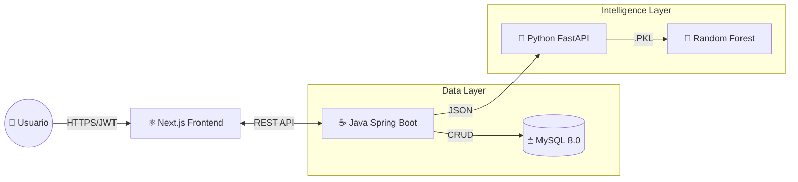
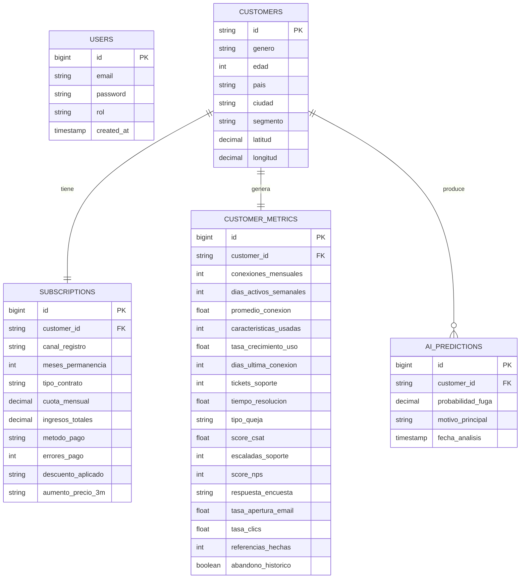

# 🏛️ Arquitectura del Sistema — RetainAI

Este documento describe el diseño técnico, el flujo de datos y las decisiones de arquitectura que hacen funcionar a RetainAI.

## 1️⃣ Diagrama de Arquitectura (Alto Nivel)

El sistema sigue un patrón de **Microservicios Híbrido** desplegado en contenedores Docker.

## 2️⃣ Estrategia de Datos — Modelo Normalizado (5 Tablas)

Para optimizar **rendimiento**, **seguridad** y **calidad de datos para IA**, RetainAI utiliza un modelo de datos normalizado compuesto por **5 entidades clave**, separando claramente identidad, finanzas, comportamiento y predicciones.

---

## 📐 Diagrama Entidad–Relación (ERD)

📘 Diccionario de Datos

🔐 USERS — Seguridad

| Campo       | Tipo      | Descripción                   |
|------------|-----------|-------------------------------|
| id         | bigint    | Identificador único           |
| email      | string    | Email del usuario             |
| password   | string    | Password hasheado             |
| rol        | string    | Rol del sistema (ADMIN, etc.) |
| created_at | timestamp | Fecha de creación             |

👤 CUSTOMERS — Identidad & Geolocalización

| Campo     | Tipo    | Descripción                   |
|----------|---------|-------------------------------|
| id       | string  | ID original del cliente (CSV) |
| genero   | string  | Género                        |
| edad     | int     | Edad                          |
| pais     | string  | País (ficticio)               |
| ciudad   | string  | Ciudad                        |
| segmento | string  | Segmento comercial            |
| latitud  | decimal | Coordenada para mapas         |
| longitud | decimal | Coordenada para mapas         |

💳 SUBSCRIPTIONS — Datos Financieros

| Campo              | Tipo    | Descripción         |
|-------------------|---------|---------------------|
| customer_id       | string  | FK a CUSTOMERS      |
| cuota_mensual     | decimal | Pago mensual        |
| ingresos_totales  | decimal | Ingresos acumulados |
| metodo_pago       | string  | Método de pago      |
| errores_pago      | int     | Fallos registrados  |
| tipo_contrato     | string  | Mensual / Anual     |
| aumento_precio_3m | string  | Flag de aumento     |

📊 CUSTOMER_METRICS — Comportamiento

| Campo                   | Tipo    | Descripción        |
|------------------------|---------|--------------------|
| customer_id            | string  | FK a CUSTOMERS     |
| conexiones_mensuales   | int     | Uso mensual        |
| dias_activos_semanales | int     | Actividad          |
| tickets_soporte        | int     | Tickets creados    |
| score_csat             | float   | Satisfacción       |
| score_nps              | int     | Net Promoter Score |
| abandono_historico     | boolean | Historial de churn |

🤖 AI_PREDICTIONS — Resultados de IA

| Campo              | Tipo      | Descripción        |
|-------------------|-----------|--------------------|
| customer_id       | string    | FK a CUSTOMERS     |
| probabilidad_fuga | decimal   | Output del modelo  |
| motivo_principal  | string    | Feature dominante  |
| fecha_analisis    | timestamp | Fecha del análisis |

🧠 Decisiones de Diseño

- **🚀 Rendimiento (Mapas y Visualización):**  
  El frontend consulta únicamente la tabla `CUSTOMERS` para obtener identificadores y coordenadas geográficas (latitud y longitud).  
  Esto reduce la latencia en visualizaciones como mapas de calor y evita cargar columnas pesadas o innecesarias en peticiones de solo lectura.

- **🔐 Seguridad y Aislamiento de Datos Financieros:**  
  La información sensible relacionada a facturación y pagos (`cuota_mensual`, `metodo_pago`, `ingresos_totales`) se encuentra aislada en la tabla `SUBSCRIPTIONS`.  
  De esta manera, el acceso a métricas de uso o comportamiento no expone datos financieros críticos, incluso ante accesos parciales del equipo o servicios.

- **🤖 Separación de Inputs y Outputs de IA:**  
  Los datos históricos de comportamiento y finanzas (`CUSTOMER_METRICS`, `SUBSCRIPTIONS`) se utilizan exclusivamente como **inputs** del modelo.  
  Las predicciones generadas se almacenan de forma independiente en `AI_PREDICTIONS`, evitando *data leakage* y dependencias circulares durante procesos de reentrenamiento.

- **📈 Escalabilidad y Versionado de Predicciones:**  
  El diseño permite **versionar** las predicciones de IA a lo largo del tiempo sin modificar los datos base del cliente.  
  Esto habilita comparaciones entre distintos modelos, análisis de evolución del riesgo de fuga y auditoría de decisiones del sistema.

- **🧩 Mantenibilidad y Evolión del Sistema:**  
  La separación clara por dominio (seguridad, identidad, finanzas, métricas y predicciones) facilita la evolución independiente de cada componente, permitiendo agregar nuevas features, métricas o modelos sin impactar el resto de la arquitectura.

## 3️⃣ Flujos Críticos

### A. Ingesta Masiva & "Efecto New York" 🗽

Al subir el CSV (`POST /api/upload`), el Backend realiza una transformación en tiempo real:

- Lee el archivo línea por línea (**Streaming**).
- Separa los datos en las 3 tablas correspondientes:
  - `customers`
  - `subscriptions`
  - `metrics`
- **Geolocalización Sintética**:  
  Si el CSV no trae coordenadas, el sistema asigna automáticamente una ubicación aleatoria dentro del área metropolitana de **New York**.

**Objetivo:**  
Generar densidad visual para el mapa de calor en la **Demo**.

---

### B. Ciclo de Predicción

- El Frontend solicita el análisis o se dispara un evento automático.
- Java recolecta datos de las 3 tablas y arma un `PredictionDTO`.
- Java envía el DTO al microservicio Python (`POST /predict`).
- Python aplica el **Pipeline** (`encoders.pkl` + `model.pkl`) y devuelve la probabilidad.
- Java guarda el resultado en `ai_predictions` y notifica al Frontend.

---

## 4️⃣ Seguridad

- **Autenticación:**  
  Stateless vía **JWT (JSON Web Tokens)**.
- **Protección:**  
  Spring Security bloquea todos los endpoints excepto:
  - `/auth/**`
  - `/api/upload` (para pruebas iniciales)
